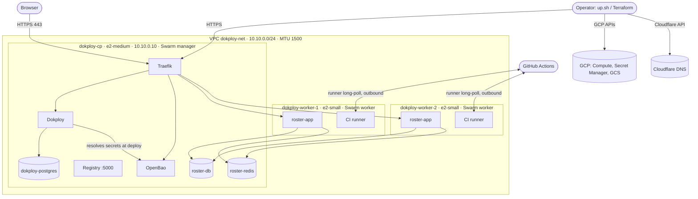
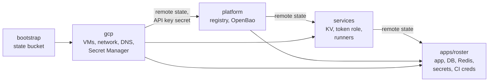
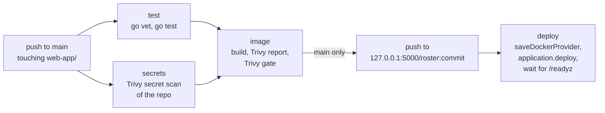

# Architecture

What runs where, how the pieces reach each other, and how it all gets built. For *why* each piece is the way it is, see [`DESIGN.md`](./DESIGN.md); for how to run it, [`README.md`](./README.md).

> Status (2026-09-30): the GCP layer has been applied and verified. The later stages (`platform`, `services`, `apps/roster`), the control plane's Dokploy bootstrap and `up.sh` are written and validated, but haven't yet been through a full `./up.sh` from nothing. See PLAN.md.

## Overview



One GCP project, three Ubuntu 24.04 VMs forming a Docker Swarm, Dokploy managing everything that runs on the swarm, and Traefik on the control plane as the only way in from the internet (plus ssh). Everything is created by Terraform, in five stages, driven by `up.sh`.

## 1. Cloud layer (`terraform/gcp`)

### Project and region

| | |
|---|---|
| GCP project | `devops-project-510215` |
| Region / zone | `europe-north1` / `europe-north1-a` (Finland) |
| APIs enabled | `compute.googleapis.com`, `secretmanager.googleapis.com` |

### Network

| Resource | Value |
|---|---|
| VPC | `dokploy-net`, custom mode, **MTU 1500** (GCP's default is 1460, too small for Swarm's overlay) |
| Subnet | `dokploy-subnet`, `10.10.0.0/24` |
| Control plane private IP | `10.10.0.10`, reserved (`dokploy-cp-internal`) |
| Control plane public IP | static (`dokploy-cp`) |
| Worker IPs | private: assigned by GCP from the subnet; public: ephemeral |

### Nodes

| VM | Machine type | Disk | Swarm role | Service account |
|---|---|---|---|---|
| `dokploy-cp` | e2-medium (2 vCPU, 4 GB) | 30 GB pd-balanced | manager (leader) | `dokploy-cp@` |
| `dokploy-worker-1` | e2-small (2 vCPU shared, 2 GB) | 15 GB pd-balanced | worker | `dokploy-worker@` |
| `dokploy-worker-2` | e2-small (2 vCPU shared, 2 GB) | 15 GB pd-balanced | worker | `dokploy-worker@` |

All run `ubuntu-os-cloud/ubuntu-2404-lts-amd64`, with the operator's ssh key installed for `ubuntu` (passwordless sudo). Worker count is `worker_count` in `terraform/gcp/terraform.tfvars`.

### Firewall (GCP, by network tag)

| Rule | From | To | Ports |
|---|---|---|---|
| `dokploy-ssh` | `0.0.0.0/0` (configurable: `ssh_source_ranges`) | all nodes (`dokploy-node`) | 22/tcp |
| `dokploy-web` | `0.0.0.0/0` | control plane (`dokploy-cp`) | 80/tcp, 443/tcp |
| `dokploy-swarm` | nodes (`dokploy-node`) | nodes | 2377/tcp, 7946/tcp+udp, 4789/udp, ICMP |

Nothing else is reachable from outside. On top of this, every node runs the **port guard** (below).

### Secret Manager

Used only to hand values between Terraform and the VMs during bootstrap. App secrets are in OpenBao.

| Secret | Written by | Readable by | Contents |
|---|---|---|---|
| `dokploy-swarm-join-token` | control plane | control plane, workers | Swarm worker join token |
| `dokploy-dokploy-admin` | Terraform | control plane | JSON: Dokploy admin name, email, generated password |
| `dokploy-dokploy-api-key` | control plane | control plane (and the project owner) | Dokploy API key used by Terraform and `up.sh` |
| `dokploy-openbao-password` | Terraform | control plane (and the project owner) | Password of OpenBao's `terraform` user |

Access is per secret (`secretAccessor` / `secretVersionAdder` IAM bindings on each secret), never project-wide.

### DNS (Cloudflare, zone `sammosios.com`)

| Record | Type | Points at | Proxied |
|---|---|---|---|
| `dokploy.sammosios.com` | A | control plane's static IP | no |
| `bao.sammosios.com` | A | control plane's static IP | no |
| `roster.sammosios.com` | A | control plane's static IP | no |

DNS-only, so Traefik answers Let's Encrypt's HTTP-01 challenge and terminates TLS itself.

### Terraform state

| | |
|---|---|
| Bucket | `gs://devops-project-510215-tfstate` (EU, versioned, public access prevented, keeps 10 old versions) |
| Prefixes | `gcp`, `platform`, `services`, `apps/roster` |
| `terraform/bootstrap` | creates the bucket; its own state is local and gitignored |

## 2. Node layer (startup scripts)

Each VM's GCE `startup-script` metadata is rendered by Terraform from `terraform/gcp/node/` and runs as root **on every boot** (`google-startup-scripts.service`, log: `journalctl -u google-startup-scripts`). Every step checks before it acts.

### All nodes (`common.sh.tftpl`)

1. **Port guard**: `/usr/local/sbin/dokploy-port-guard` plus the `dokploy-port-guard.service` systemd unit (runs before `docker.service`, and again on every Docker restart). iptables rules:
   - `DOCKER-USER` → `DOKPLOY-GUARD-FWD`: drops new connections to published ports 3000, 5000 and 8200 unless they come from `lo`, `docker0`, `docker_gwbridge` or `br+`.
   - `INPUT` → `DOKPLOY-GUARD-IN`: same for the host's own sockets; Swarm ports (2377, 7946, 4789) only from `10.10.0.0/24`; all of these closed over IPv6.
2. **Docker 28.5.0** from `get.docker.com`, `apt-mark hold`, after waiting out Ubuntu's own apt run.

### Control plane (`cp.sh.tftpl`)

3. **Dokploy v0.30.7** via `dokploy.com/install.sh` with `ADVERTISE_ADDR=10.10.0.10`, only if no `dokploy` service exists (the installer starts with `docker swarm leave --force`). The installer runs `docker swarm init`, creates the `dokploy-network` overlay, and starts Dokploy, its Postgres, and Traefik.
4. `docker swarm update --task-history-limit 1`.
5. Publishes the worker join token to `dokploy-swarm-join-token` if it changed.
6. Creates two Swarm secrets, if missing:
   - `openbao-unseal-key`: 32 random bytes from `/dev/urandom`, generated on the node, never leaves it.
   - `openbao-terraform-password`: the value of `dokploy-openbao-password`.
7. **`dokploy-bootstrap`** (`node/dokploy-bootstrap.py`), against `http://127.0.0.1:3000`:
   - waits for Dokploy;
   - if the stored API key is missing or rejected: signs up the first admin from `dokploy-dokploy-admin` (or signs in, if it exists), creates an API key with rate limiting off (`user.createApiKey`), and stores it in `dokploy-dokploy-api-key`;
   - sets Dokploy's own domain (`settings.assignDomainServer`): `dokploy.sammosios.com`, HTTPS, Let's Encrypt, `sam.mosios+letsencrypt@gmail.com`, unless it's already set.

### Workers (`worker.sh.tftpl`)

3. If not already in a swarm: polls `dokploy-swarm-join-token` (every 10 s, up to 30 min), then `docker swarm join --token … 10.10.0.10:2377` (retried up to 30 times).

### Bootstrap sequence

```mermaid
sequenceDiagram
  participant TF as terraform/gcp
  participant SM as Secret Manager
  participant CP as dokploy-cp
  participant W as workers
  TF->>SM: dokploy-admin, openbao-password
  TF->>CP: create VM (startup script)
  TF->>W: create VMs (startup script)
  CP->>CP: port guard, Docker, Dokploy (swarm init)
  W->>W: port guard, Docker
  W-->>SM: poll join token
  CP->>SM: write join token
  SM-->>W: join token
  W->>CP: docker swarm join 10.10.0.10:2377
  CP->>CP: Swarm secrets for OpenBao
  CP->>SM: read admin; write API key
  CP->>CP: assignDomainServer → Traefik gets LE cert
```

## 3. Swarm and Dokploy

### Swarm

- 1 manager (`dokploy-cp`), N workers, advertise address `10.10.0.10`.
- Overlay network **`dokploy-network`** (attachable), created by Dokploy's installer. Every Dokploy-managed service joins it, and services reach each other by name on it.
- Routing mesh (ingress): the registry's port 5000 is published there, so every node reaches it at `127.0.0.1:5000`.
- Task history limit: 1.

### Dokploy's own components (control plane)

| Component | How it runs | Notes |
|---|---|---|
| `dokploy` | Swarm service, pinned to the manager | UI and API on :3000 (host mode, blocked by the port guard); reached via Traefik |
| `dokploy-postgres` | Swarm service | Dokploy's own database |
| `dokploy-traefik` | plain container (`docker run`), Traefik v3.6.25 | host ports 80/443; file provider (`/etc/dokploy/traefik/dynamic`) plus Swarm labels; ACME resolver `letsencrypt` |

### Dokploy projects and what runs where

| Dokploy project | Resource | Kind | Image | Runs on | Stage |
|---|---|---|---|---|---|
| `infrastructure` | `registry` | compose, type stack | `registry:3` | manager (pinned) | platform |
| `infrastructure` | `openbao` | compose, type stack | `openbao/openbao:2.7.0` | manager (pinned) | platform |
| `infrastructure` | `github-runner` | compose, type stack | `myoung34/github-runner:2.337.0-ubuntu-noble` | every worker (global mode) | services |
| `roster` | `roster-db` | Dokploy Postgres | `postgres:18` | manager (Dokploy pins volumes) | apps/roster |
| `roster` | `roster-redis` | Dokploy Redis | `redis:8` | manager | apps/roster |
| `roster` | `roster-app` | Dokploy application, Docker source | `127.0.0.1:5000/roster:<commit>` | workers in practice (2 replicas, no constraint) | apps/roster; image set by CI |

Also in Dokploy: the registry entry `cluster-registry` (`127.0.0.1:5000`), the secrets providers `bao-infrastructure` and `bao-roster`, the domain `roster.sammosios.com` on `roster-app`, and API keys `terraform` (made by the control plane) and `github-actions` (made by `apps/roster`).

## 4. Services

### Registry

- `registry:3`, volume `registry-data` on the manager, published on the routing mesh at **5000**, used by every node as `127.0.0.1:5000` (never `localhost`: moby/moby#53091).
- htpasswd auth: user `dokploy`, password generated in `terraform/platform`. The htpasswd line reaches the container base64-encoded in `HTPASSWD_B64`; the entrypoint writes `/auth/htpasswd` and starts the registry.
- Deletes enabled (`REGISTRY_STORAGE_DELETE_ENABLED`), for garbage collection.

### OpenBao

- `openbao/openbao:2.7.0`, one node, Raft storage in volume `openbao-data` on the manager, `disable_mlock`.
- Config passed as JSON in `BAO_LOCAL_CONFIG`; listener `0.0.0.0:8200`, plain HTTP inside the overlay.
- **Seal:** `static`, key id `cluster-1`, key from the Swarm secret `openbao-unseal-key` (auto-unseal on every start).
- **Self-initialization** on first start (then the root token is revoked, never handed out):
  1. policy `terraform`: all capabilities, including `sudo`, on `*`;
  2. auth method `userpass` at `auth/userpass`;
  3. user `terraform`, password from the Swarm secret `openbao-terraform-password`, policy `terraform`, 1 h tokens.
- Reached as:
  - `http://openbao:8200` over `dokploy-network` (Dokploy's server, alias on the service);
  - `https://bao.sammosios.com` through Traefik, via labels written into the stack (routers `openbao-web` → redirect, `openbao-websecure` → TLS with `letsencrypt`).
- Managed by `terraform/services` (logs in as `terraform`):
  - KV v2 mount `secret/`;
  - token role `dokploy-provider`: orphan, renewable, period 768 h, no default policy, may only grant `dokploy-project-*`.

**Per-project secrets providers** (`terraform/modules/project-secrets`), one per Dokploy project that uses secrets:

| | `infrastructure` | `roster` |
|---|---|---|
| OpenBao policy | `dokploy-project-infrastructure` | `dokploy-project-roster` |
| Can read | `secret/data/infrastructure/*` | `secret/data/roster/*` |
| Token | from `dokploy-provider`, renewed by any apply within 14 days of expiry | same |
| Dokploy provider | `bao-infrastructure`, assigned to `infrastructure` only | `bao-roster`, assigned to `roster` only |
| KV secrets | `secret/infrastructure/github` (`runner_pat`) | `secret/roster/app` (`DATABASE_URL`, `REDIS_URL`, `ADMIN_EMAIL`, `ADMIN_NAME`, `ADMIN_PASSWORD`) |

Each policy also allows `auth/token/lookup-self` (for Dokploy's connection test) and listing `secret/metadata/`.

### CI runners

- Swarm **global** service on `node.role == worker`: one runner per worker.
- Ephemeral: one job per container. Registers with the PAT (`ACCESS_TOKEN`, resolved by Dokploy at deploy from `${{vault.bao-infrastructure.infrastructure/github:runner_pat}}`) against `sammosios/dd2482-project`, labels `self-hosted, dokploy`.
- The node's `/var/run/docker.sock` is mounted: jobs build with, and push from, the node's own Docker.

### Roster (example app)

- Two replicas of `127.0.0.1:5000/roster:<commit>` on port 8080, served at `https://roster.sammosios.com` (Dokploy domain, Let's Encrypt).
- Env holds only references plus a version counter:
  ```
  DATABASE_URL=${{vault.bao-roster.roster/app:DATABASE_URL}}
  REDIS_URL=${{vault.bao-roster.roster/app:REDIS_URL}}
  ADMIN_EMAIL=…  ADMIN_NAME=…  ADMIN_PASSWORD=…   (same form)
  SECRETS_VERSION=<KV version of secret/roster/app>
  ```
- Database and Redis passwords are generated by Terraform. The app reaches them by their Dokploy app names over `dokploy-network` (`postgresql://roster:…@roster-db-xxxxxx:5432/roster`, `redis://default:…@roster-redis-xxxxxx:6379`).

## 5. Traffic paths

| From | To | Path |
|---|---|---|
| Browser | Dokploy UI | `https://dokploy.sammosios.com` → Traefik :443 (file-provider route from `assignDomainServer`) → `dokploy:3000` |
| Browser | OpenBao UI | `https://bao.sammosios.com` → Traefik :443 (Swarm labels) → `openbao:8200` over `dokploy-network` |
| Browser | Roster | `https://roster.sammosios.com` → Traefik :443 → `roster-app` replicas over `dokploy-network` (on the workers) |
| HTTP :80 | any of the above | Traefik `web` entrypoint → `redirect-to-https` |
| Dokploy | OpenBao | `http://openbao:8200` over `dokploy-network`, at deploy time, with the project's provider token |
| Any node | Registry | `127.0.0.1:5000` → routing mesh → registry task on the manager |
| Worker | Control plane | Swarm control 2377/tcp, gossip 7946, VXLAN 4789/udp inside the VPC |
| CI job (worker) | Dokploy API | `https://dokploy.sammosios.com` (out through the worker's public IP, back in through the firewall's 443) |
| Operator | Dokploy / OpenBao | `https://dokploy.…` / `https://bao.…`, with the key / password from Secret Manager |
| Operator | nodes | ssh as `ubuntu`, key only (debugging; nothing in the setup needs it) |

### Ports on the control plane

| Port | Listener | Reachable from outside? |
|---|---|---|
| 22 | sshd | yes (key only) |
| 80, 443 | Traefik | yes |
| 3000 | Dokploy (host-mode publish) | no: port guard (and GCP firewall) |
| 5000 | registry (routing mesh) | no: port guard (and GCP firewall) |
| 2377, 7946, 4789 | Swarm | only from `10.10.0.0/24` |

## 6. Where each credential lives

| Credential | Generated by | Stored in | Used by |
|---|---|---|---|
| Dokploy admin password | Terraform (`gcp`) | Secret Manager, `gcp` state | the operator (UI), control plane bootstrap |
| Dokploy API key `terraform` | control plane | Secret Manager | `platform`, `services`, `apps/roster`, `up.sh` |
| Dokploy API key `github-actions` | `apps/roster` | its state, GitHub Actions secret `DOKPLOY_API_KEY` | CI deploy job |
| Swarm join token | Swarm | Secret Manager | workers |
| OpenBao unseal key | control plane | Swarm secret only | OpenBao |
| OpenBao `terraform` password | Terraform (`gcp`) | Secret Manager, Swarm secret, `gcp` state | `services`, `apps/roster`, the operator (UI) |
| OpenBao provider tokens | `services`, `apps/roster` | Dokploy (masked), their states | Dokploy at deploy time |
| Registry password | Terraform (`platform`) | its state, Dokploy registry entry, GitHub Actions secret `REGISTRY_PASSWORD` | Dokploy/Swarm (pull), CI (push) |
| Runner GitHub PAT | the operator | `services/terraform.tfvars` (local), OpenBao `secret/infrastructure/github`; **not** in state (write-only) | runners |
| Roster DB / Redis / admin passwords | Terraform (`apps/roster`) | its state, OpenBao `secret/roster/app`, Dokploy's Postgres/Redis records | the app |
| Cloudflare token | the operator | `gcp/terraform.tfvars` (local) | `terraform/gcp` |

Resolved `${{vault…}}` values also end up in `/etc/dokploy/compose/<app>/code/.env` on the control plane and in the Swarm service specs.

## 7. Terraform stages



| Stage | Providers | Reads | Creates |
|---|---|---|---|
| `bootstrap` | google | – | state bucket |
| `gcp` | google, random, cloudflare | tfvars | APIs, VPC, subnet, IPs, firewall, service accounts, secrets (+ IAM, 2 versions), VMs, DNS records |
| `platform` | google, random, dokploy | `gcp` state, API key secret | project `infrastructure`, registry stack, `cluster-registry`, OpenBao stack |
| `services` | google, vault, dokploy | `gcp` + `platform` state, API key and OpenBao password secrets | `secret/` mount, `dokploy-provider` role, `bao-infrastructure`, PAT in KV, runner stack |
| `apps/roster` | google, vault, dokploy, random, github | `gcp` + `platform` + `services` state, secrets, `GITHUB_TOKEN` | project `roster`, Postgres, Redis, `bao-roster`, KV secret, app, domain, CI API key, GitHub Actions secrets/variables |

Shared module: `terraform/modules/project-secrets` (policy, token, Dokploy provider).

## 8. Orchestration: `up.sh`

1. Check tools and credentials (`terraform`, `gh`, `gcloud` ADC, tfvars files).
2. Apply `bootstrap`.
3. Apply `gcp`, then **wait** (up to 20 min) until `https://dokploy.sammosios.com` answers with a valid certificate and accepts the key in `dokploy-dokploy-api-key`.
4. Apply `platform`, then **wait** (up to 10 min) for `https://bao.sammosios.com/v1/sys/health` → 200 (initialized, unsealed, active).
5. Apply `services`, then **wait** (up to 10 min) for a runner to be online on GitHub.
6. Compute `TAG` = last commit on `origin/main` touching `web-app/`.
   - If the app already runs `roster:<TAG>`: apply `apps/roster` and stop.
   - Otherwise: apply `apps/roster` with `deploy_app=false`, `image_tag=<TAG>`; `gh workflow run web-app-ci.yml --ref main`; wait for it; apply `apps/roster` again.
7. Print URLs and where each login's password is.

`down.sh` destroys `apps/roster` → `services` → `platform` → `gcp` (the bucket stays). `--forget` drops the state of stages whose cluster is already gone, after removing the GitHub secrets and variables.

## 9. CI/CD



- `.github/workflows/web-app-ci.yml`, all jobs on `[self-hosted, dokploy]`; `test` and `secrets` run in parallel and the image is only built if both pass; branches other than `main` stop after the Trivy gate.
- The deploy job runs `.github/scripts/deploy-roster.sh` with `DOKPLOY_URL`, `ROSTER_APP_ID`, `ROSTER_URL`, `REGISTRY_ADDR`, `REGISTRY_USER` (Actions variables) and `DOKPLOY_API_KEY`, `REGISTRY_PASSWORD` (Actions secrets), all set by `terraform/apps/roster`.
- Terraform ignores the app's image (`ignore_changes = [docker]`): **Terraform owns how the app runs, CI owns which image.**

## 10. Pinned versions

| Component | Version | Where |
|---|---|---|
| Ubuntu | 24.04 LTS | `terraform/gcp/main.tf` |
| Docker Engine | 28.5.0 | `docker_version` (gcp) |
| Dokploy | v0.30.7 | `dokploy_version` (gcp) |
| Traefik | v3.6.25 | set by Dokploy's installer |
| Registry | `registry:3` | `terraform/platform` |
| OpenBao | 2.7.0 | `terraform/platform` |
| GitHub runner | `myoung34/github-runner:2.337.0-ubuntu-noble` | `terraform/services` |
| PostgreSQL / Redis | 18 / 8 | `terraform/apps/roster` |
| Terraform | ≥ 1.11 | stages |
| Providers | google ~> 6.0, cloudflare ~> 5.0, vanillauys/dokploy ~> 1.7, vault ~> 5.0, github ~> 6.0, random ~> 3.6 | `versions.tf` per stage, locked for darwin_arm64 and linux_amd64 |
